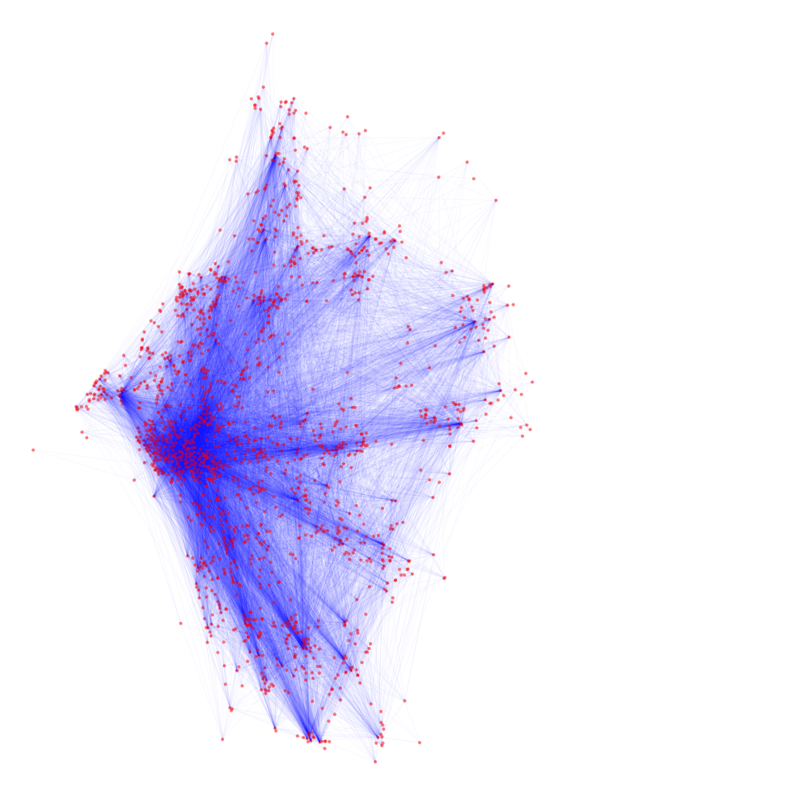
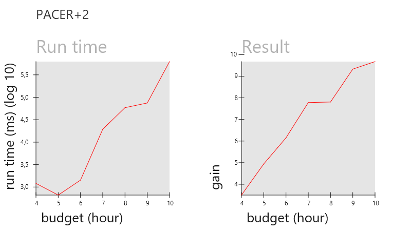

# Top k-routes with preferences
 ### References
 This project is completely based on the following work:
*"Top-k Route Search through Submodularity Modeling of Recurrent POI Features"* by *Hongwei Liang* and *Ke Wang*.
 Links to the original work:  
1. [Paper of Top-k route search](http://www.sfu.ca/~hongweil/files/RouteSearch-sigir18.pdf) The original algorithm paper.
2. [Hop Doubling Label Indexing for Point-to-Point Distance Querying on Scale-Free Networks](http://www.vldb.org/pvldb/vol7/p1203-jiang.pdf)
 paper, that is frequently referenced. Its algorithm is used inside the top-k search.  
3. [github](https://github.com/LazyAir/SIGIR18) of the original work. (Implemented in `C++`)

### Description
 This is my coursework for the first term of *Algorithms and data structures* course at university.  
The aim of it is to reproduce the results from the original paper.  
I'm implementing the algorithm in `Java`
##### Algorithm Task
The algorithm searches for an optimal path with defined user preferences. Basically, path Vertexes are **POIs** 
(Places of Interest) in some city and user specifies what kind of POIs he wants to visit. The task is to generate
a subset of POIs that best matches user's preferences and an optimal route between them.   
User needs to specify the following parameters:

Parameter|Description|Values
---|---|---
***start***|The POI from which user starts the path|vertex id
***end***|The POI where user wants to be in the end|vertex id
***budget***|The time user has, during which he can visit some POIs|minutes
***feature preference***|A vector, in which user specifies which features he wants to visit. For each feature they choose a value in range `0`-`1`, which represents how much they want to have this feature in their route. The sum of all items in vector should be equal to 1.|vector
***pathNumber***|How many top paths user wants to find| gt 0

##### Data
Algorithm receives the following data:

Name|File|Description
---|---|---
Vertex Cost|`_stayTime.txt`|The cost of staying in each of the POIs - vertexes of our graph
Edges|`_undir_edges.txt`|All the edges present in our graph - routes between POI's. And the cost of travelling on each of the edges
Features|`_inverted_kwds.txt`|What kind of features does each POI have and its rating (in range 0-5). For example, a POI may have feature `museum` with rating 5. The data in file is reversed - for each feature all the vertexes having it are stored.
2 Hop Label|`_undir_2hop.txt`|(generated by the algorithm before usage) The 2 hop label table, used to search for the shortest route between any 2 vertexes. 

All the edges of the graph can be seen on this visualisation:

### Structure & functions
##### Folders
`data` - folder, containing all the data.  
 All the code is inside the `src/main/java` folder:  
 
`offline` - folder, containing the *2-hop label indexing* algorithm. It has a single class responsible for the generation
of labels. It's main function is `processEdges` which takes 2 arguments - `pathFrom` and `pathTo`, which are the source
and target files.  

 `online` - folder, containing objects, responsible for retrieving all the required data for *top-k route search* algorithm.
It contains `FeaturesFrame`, `TwoHopFrame` and `WeightFrame` responsible for opening and processing of the
vertex-feature, two-hop and stay-time tables accordingly. It also contains `Query` and `QueryResult`, which are responsible for
processing user queries. Additionally it contains `Visualisation App` for data visualisation.

##### Usage
`Main` class should be used to test the algorithm implementation.  

`Online` is the class responsible for responding to all user queries. It can run the following functions:  

* `getPathCost(start, end)`  
Returns the cost of the shortest path between 2 vertexes. Uses the 2-hop algorithm.  

* `getPath(start, end)`  
Returns a `List` of vertexes, that form the optimal path between 2 vertexes.
  
* `processQuery(Query query)`  
Takes an instance of the `Query` class. 
Returns a `QueryResult` instance. Query result has all the results of the processed query. To get them user can use
functions `getOptimalPathsNumber()`, `getOptimalPath(index)`, `getOptimalPaths()`.

To Visualise data, the functions of `VisualisationApp` can be used:
* `drawPath` - draws a path of vertexes, returned by the `qetPath()` function.
* `drawVisitPath` - draws a path of vertexes, returned by the `processQuery()` function. The path will draw vertexes, that
user needs to visit in `black`, while those that they should only pass on the way in `purple`.

### Algorithm implementation description
##### 2-hop Labeling
The 2-hop labeling algorithm solves the problem of generating the (almost) shortest path for each pair of vertexes.
Because generating all the possible combinations would take up <code>n2</code> storage space, which is too much,
the 2 hop labeling formulates the task in the following way:
> For every 2 vertexes <code>v1</code> and <code>v2</code> there are 2 generated paths,  
such that
<code>p1 = v1 -> v3</code> and <code>p2 = v2 -> v3</code>.  
<code>v3</code> is then called a pivit.  
The 2 paths <code>p1</path></code> and <code>p2</path></code> are called hops.

Basically this means, that every path can be created from 2 hops, if we find the minimal pivit, common for both vertexes.  
The results of 2-hop label generation are directly used inside this algorithm.

##### Path gain
Path gain is just how well the path matches the parameters, specified by user. Because, we are only interested in what POI's
user visits, the order of vertexes is not important and we can calculate the gain on the set of vertexes.  
The gain is calculated using an exponential aggregation function. 

That to get gain we sum over all the combinations of `[feature rating at POI] * [feature preference]` for every feature 
and POI in our path. Because users mostly like diversity in their route, we multiply this by <code>i-a</code>,
where `i` is the number POI's with this feature have already occured, sorted by feature rating and `a` is a parameter `> 0`
how much diversity user wants.

##### PACER
To find the optimal paths, the algorithm goes through all the possible combinations of the paths and saves the best on
the way. It first generates smaller paths and then recursively calls itself to grow them into larger paths.  

On each iteration the cost and gain of path is calculated. Because gain calculation can be costy to resources and is
independent of the order of vertexes in path, we can calculate it for vertex set.

Algorithm uses **dynamic programming**. Because for each path we are only interested in its set of vertexes and end 
vertex, we use them as a key to store data. New path can then be generated by adding the new vertex to the paths
with all possible end vertex, that are in our path set.

Because calculation of all the possible combinations takes too long, 2 pruning strategies are used to make the calculation
shorter:  
**Pruning by cost** - when the path costs too much, it cannot be in our result. All the paths, that are extensions of this one
are also ignored.  
**Pruning by gain** - for each path we calculate the Upper bound of its cost. Then we ignore the path if the upper bound 
of its cost is less than of all the paths in out top-k list.  
To calculate the upper bound, we first calculate the number
of vertexes, that can be still added to the path (We sum the minimal hops to vertexes
not in this path until we have not budget left). Then, we find the best vertexes, using a greedy algorithm of sorting vertexes
by gain/cost. We add the maximal number of the best vertex costs and get our upper bound.

### Result
The experimental tests were performed on the data for **Singapore**.  
The result was the following:  

The first graph represents a relating between the run time of the algorithm and the parameter budget in user query.  
The second graph represents a relation between the budget and gain of result.

##### Summary
The results are quite close to the ones produced in the original algorithm.  

We can see that run time is growing
as budget increases. The run time is so large for the budget of 4 hours only because the CPU was also busy doing other
stuff (like loading Java visualisations) and so it took a longer time.

The gain increases almost linearly as, the budget increases, which is also quite expected.
